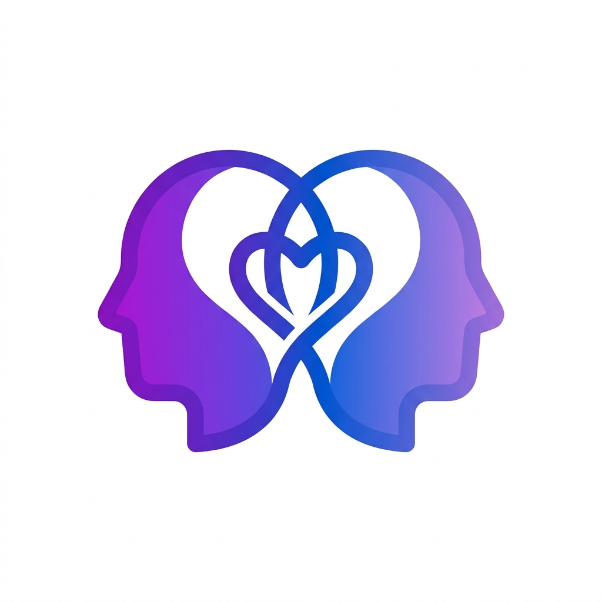

# Relate / 同频 🪐

Relate (同频) is an AI-driven relational coach application leveraging MBTI cognitive functions and Nonviolent Communication (NVC) frameworks. It provides personalized, deep psychological insights to help you navigate your interpersonal relationships with family, partners, friends, and colleagues.



## Features 🚀
- **Personality Profiling (Observer Profiling):** Rapid 4-question behavioral profiling engine to easily deduce anyone's MBTI based on their day-to-day actions.
- **Dynamic Scenario AI Engine:** Powered by **Google Gemini 2.5 Flash**, it dynamically generates conflict-resolution and advice scenarios tailored specifically to the collision of *your* personality and *their* personality.
- **Glassmorphism UI:** A sleek, premium, highly interactive frontend aesthetic utilizing custom CSS modules and aesthetic tokens.
- **i18n Support:** First-class multi-language toggling for a seamless English (Relate) and Chinese (同频) experience.
- **Soft-Login System:** A frictionless entry utilizing local storage and an email-based identity retrieval system without the heavy lift of passwords during the MVP phase.

## Tech Stack 🛠️
- **Frontend:** Next.js (App Router), React, CSS Modules
- **Backend/API:** Next.js Serverless API Routes
- **Database:** SQLite paired with Prisma ORM
- **AI Core:** `@google/genai` (Gemini SDK)

## Getting Started 💻

### 1. Installation
Clone the repository and install the initial dependencies:
```bash
git clone https://github.com/hopejimmy/MeetLove.git
cd MeetLove
npm install
```

### 2. Configure Environment Variables
You will need a Google Gemini API Key for the AI core engine to output dynamic advice.
Create a `.env.local` file in the root directory:
```env
GEMINI_API_KEY="your_google_gemini_api_key_here"
```

### 3. Database Initialization
This application uses a local SQLite database (`dev.db`). It automatically provisions its schema definitions upon Prisma setup. Ensure Prisma is actively synchronized:
```bash
npx prisma db push
# If you want to view the database visually:
npx prisma studio
```

### 4. Run the Development Server
```bash
npm run dev
```
Navigate to [http://localhost:3000](http://localhost:3000) to view the application. 

## Roadmap & MVP Status 🗺️
Phase 1 & 2 have been successfully developed for MVP:
- ✅ **M1:** Core infrastructure, Prisma Schema, Glassmorphism UI tokens.
- ✅ **M2:** i18n engine, Soft Login (`/login`), Relative Adding (`/dashboard/add-relative`), Interactive Onboarding Quiz.
- ✅ **M3:** Google Gemini SDK integration, dynamic real-time communication advice with character context logic.

---
*Built with ❤️ and psychological resonance.*
